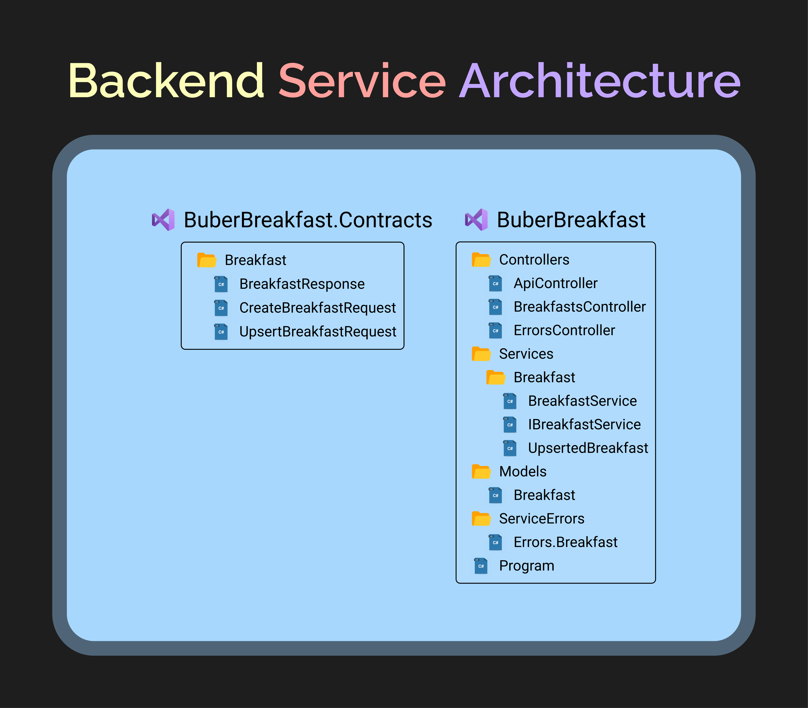
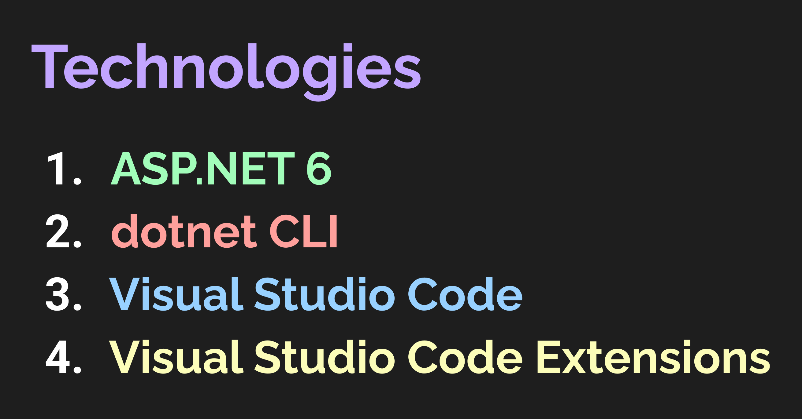
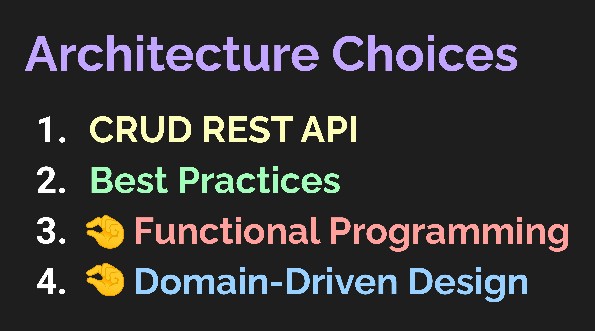

# commands

- dotnet new sln -o BuberBreakfast
- dotnet new classlib -o BuberBreakfast.Contracts
- dotnet new webapi -o BuberBreakfast

# visual studio code 
- ctrl + shift + p > open commands
- code .   | opens visual studio on current directory

## add projects to the solution
- dotnet sln add .\BuberBreakfast.Contrats .\BuberBreakfast\
- or add all projects recursively "dotnet sln add (ls -r **/*.csproj)
- dotnet build
- dotnet run   | run --project .\BuberBreakfast\
- dotnet watch run --project .\Projecthere.Api\

- dotnet add .\BuberBreakfast\ package ErrorOr    

## add references between the two projects
- dotnet add .\BuberBreakfast\ reference .\BuberBreakfast.Contracts\


# index
- [API Definition](#api-definition)
  - [Create Breakfast](#create-breakfast)
    - [Create Breakfast Request](#create-breakfast-request)
    - [Create Breakfast Response](#create-breakfast-response)
  - [Get Breakfast](#get-breakfast)
    - [Get Breakfast Request](#get-breakfast-request)
    - [Get Breakfast Response](#get-breakfast-response)
  - [Update Breakfast](#update-breakfast)
    - [Update Breakfast Request](#update-breakfast-request)
    - [Update Breakfast Response](#update-breakfast-response)
  - [Delete Breakfast](#delete-breakfast)
    - [Delete Breakfast Request](#delete-breakfast-request)
    - [Delete Breakfast Response](#delete-breakfast-response)
- [Credits](#credits)
- [VSCode Extensions](#vscode-extensions)
- [Disclaimer](#disclaimer)
- [License](#license)

---

# Give it a star ⭐!

Loving it? Show your support by giving this project a star!

# Overview

In the tutorial, we build a CRUD REST API from scratch using .NET 6.
As you would expect, the backend system supports Creating, Reading, Updating and Deleting breakfasts.

# Service Architecture

<div align="center">



</div>

# Technologies

<div align="center">



</div>

# Architecture

<div align="center">



</div>

# API Definition


## Create Breakfast

### Create Breakfast Request

```js
POST /breakfasts
```

```json
{
    "name": "Vegan Sunshine",
    "description": "Vegan everything! Join us for a healthy breakfast..",
    "startDateTime": "2022-04-08T08:00:00",
    "endDateTime": "2022-04-08T11:00:00",
    "savory": [
        "Oatmeal",
        "Avocado Toast",
        "Omelette",
        "Salad"
    ],
    "Sweet": [
        "Cookie"
    ]
}
```

### Create Breakfast Response

```js
201 Created
```

```yml
Location: {{host}}/Breakfasts/{{id}}
```

```json
{
    "id": "00000000-0000-0000-0000-000000000000",
    "name": "Vegan Sunshine",
    "description": "Vegan everything! Join us for a healthy breakfast..",
    "startDateTime": "2022-04-08T08:00:00",
    "endDateTime": "2022-04-08T11:00:00",
    "lastModifiedDateTime": "2022-04-06T12:00:00",
    "savory": [
        "Oatmeal",
        "Avocado Toast",
        "Omelette",
        "Salad"
    ],
    "Sweet": [
        "Cookie"
    ]
}
```

## Get Breakfast

### Get Breakfast Request

```js
GET /breakfasts/{{id}}
```

### Get Breakfast Response

```js
200 Ok
```

```json
{
    "id": "00000000-0000-0000-0000-000000000000",
    "name": "Vegan Sunshine",
    "description": "Vegan everything! Join us for a healthy breakfast..",
    "startDateTime": "2022-04-08T08:00:00",
    "endDateTime": "2022-04-08T11:00:00",
    "lastModifiedDateTime": "2022-04-06T12:00:00",
    "savory": [
        "Oatmeal",
        "Avocado Toast",
        "Omelette",
        "Salad"
    ],
    "Sweet": [
        "Cookie"
    ]
}
```

## Update Breakfast

### Update Breakfast Request

```js
PUT /breakfasts/{{id}}
```

```json
{
    "name": "Vegan Sunshine",
    "description": "Vegan everything! Join us for a healthy breakfast..",
    "startDateTime": "2022-04-08T08:00:00",
    "endDateTime": "2022-04-08T11:00:00",
    "savory": [
        "Oatmeal",
        "Avocado Toast",
        "Omelette",
        "Salad"
    ],
    "Sweet": [
        "Cookie"
    ]
}
```

### Update Breakfast Response

```js
204 No Content
```

or

```js
201 Created
```

```yml
Location: {{host}}/Breakfasts/{{id}}
```

## Delete Breakfast

### Delete Breakfast Request

```js
DELETE /breakfasts/{{id}}
```

### Delete Breakfast Response

```js
204 No Content
```

# Credits

- [ErrorOr](https://github.com/amantinband/error-or) - A simple, fluent discriminated union of an error or a result.

# VSCode Extensions
- [VSCode Rest Client | Rest Client](https://github.com/Huachao/vscode-restclient) - REST Client allows you to send HTTP request and view the response in Visual Studio Code directly.
, Settings -> Packages -> markdown-preview-enhanced -> Settings.
, select your atom theme
- [VSCode Markdown Preview Enhanced](https://github.com/shd101wyy/vscode-markdown-preview-enhanced) - Markdown Preview Enhanced is an extension that provides you with many useful functionalities for previewing markdown files. if we want to make multiple definitions of requests inside the same file write ### between the requests
- [Path Intellisense](https://marketplace.visualstudio.com/items?itemName=christian-kohler.path-intellisense) autocompletes paths
- [SQL Server (mssql)](https://marketplace.visualstudio.com/items?itemName=ms-mssql.mssql)

- [Roslynator]](https://github.com/dotnet/roslyn) - analysor
- Auto-Using for C#
- .NET Core Test Explorer - helps with testing
- [NuGet Reverse Package Search](https://marketplace.visualstudio.com/items?itemName=jesschadwick.nuget-reverse-package-search) (ctrç + shift + p -> then write nugget reverse.. and it searchs for the missing package)
- EditorConfig for VS Code
- [jwt-decoder](https://marketplace.visualstudio.com/items?itemName=jflbr.jwt-decoder)
# Disclaimer

This is an educational project. The source code is licensed under the MIT license.

# License

This project is licensed under the terms of the [MIT](https://github.com/amantinband/buber-breakfast/blob/main/LICENSE) license.
